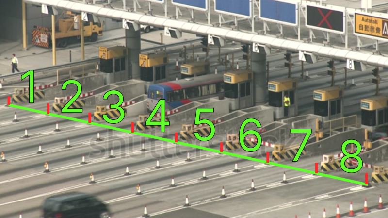

# AI Engineer Intern Knowledge Test

## Introduction

**Vehicle counter** is a computer vision task that aims to count the number of vehicles in a image or video. This task is important for traffic monitoring, urban planning, public safety, and more.

In this knowledge test, you will be asked to implement an **vehicle counter system** based on **deep learning**. The system should be able to count the number of vehicles that **pass through a specific gate** in a [provided video](assets/toll_gate.mp4).

## Requirements

The specific requirements of the system are as follows:

1. **Read The Input Video File**: Implement a function that can read a video file and extract video frames.
2. **Vehicle Detection**: Implement a vehicle detection model that can detect vehicles in a video frame. The model should be able to detect **car and bus** categories. **You can use any pre-trained** object detection model for this task.
3. **Vehicle Tracking**: Implement a vehicle tracking algorithm that can track vehicles across video frames. The algorithm should be able to **assign a unique ID** to each vehicle and track its movement.
4. **Vehicle Counting**: Implement a vehicle counting algorithm that can count the number of vehicles (car and bus) that pass through a specific gate in the video. **The gate can be defined as a line or a region** in the video frame.
5. **Visualization**: Implement a visualization function that can display:
    - Bounding boxes for detected vehicles
    - Unique IDs for tracked vehicles
    - A count of vehicles (car or bus) that pass through the gate
6. **Output Video**: Save the output video (`.mp4`, `.avi`, etc.) that shows the visualization of the vehicle counter system.

You are free to use any programming language (**Python** is preferred), image processing library (**OpenCV** is preferred), object detection model (**YOLO** is preferred), and tracking algorithm (**simple centroid tracking** is OK) of your choice to implement the system.

The video file can be found in the [assets](assets) directory. The video file is named [`toll_gate.mp4`](assets/toll_gate.mp4).

You can use the image below as a reference to define gates in the video frame. But **you are free to define gates** in any way you like. For example, if you have difficulty to define it as 8 gates, **you can define it as 1 gate**.

## Evaluation

The goal of this knowledge test is to evaluate your ability to implement an end-to-end computer vision system based on deep learning. If you can't complete all the requirements, **we encourage you to submit a partial solution**. We will evaluate your submission **even if it's incomplete**.

Your submission will be evaluated based on the following criteria:

1. Read The Input Video File: **10 points**. Whether the system can read the input video file and extract video frames.
2. Vehicle Detection: **30 points**. Whether the system can detect vehicles (car and bus) in the video frames.
3. Vehicle Tracking: **20 points**. Whether the system can track vehicles across video frames.
4. Vehicle Counting: **20 points**. Whether the system can count the number of vehicles that pass through the gate in the video.
5. Visualization: **10 points**. Whether the system can display the visualization of the vehicle counter system.
6. Output Video: **10 points**. Whether the system can save the output video that shows the visualization of the vehicle counter system.

The total score is **100 points**.

## Submission

To submit your solution, please follow these steps:

- Should be link to a public repository (GitHub, GitLab, etc.) that contains the source code and the assets (video file, diagram, etc.). **We only accept links to public repositories not zip files**.
- The repository should contain a **README** file that explains how to run the system and any additional information you want to share with us.
- **You don't need** to write a document (`.pdf`, `.ppt`, etc.) to explain your solution. The README file should contain all the necessary information.

Please submit your solution **before the deadline** by filling out this [form](https://forms.gle/mmSEuxrbMjjFwDMcA) (https://forms.gle/mmSEuxrbMjjFwDMcA).

If you have any questions about the knowledge test, please don't hesitate to contact us:

- bagus.mbap@gmail.com
- ruhyadi.dr@gmail.com
